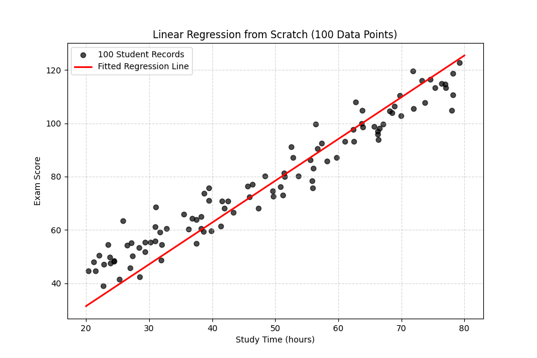
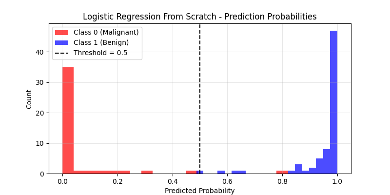
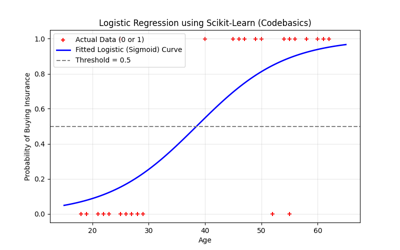

# Machine Learning Lab Assignments

| Lab No. | Topic | Implementation Type | Code Link |
| :---: | :--- | :--- | :--- |
| **01** | Linear Regression | From Scratch (100 Samples) | [01_Linear_Regression](./01_Linear_Regression/) |
| **02** | Logistic Regression | Scikit-Learn | [logistic_regression_sklearn.py](./02_Logistic_Regression/logistic_regression_sklearn.py) |
| **02** | Logistic Regression | From Scratch (Mathematical) | [logistic_regression_from_scratch.py](./02_Logistic_Regression/logistic_regression_from_scratch.py) |

---

## Lab Outputs & Visualizations

### Lab 01: Linear Regression

### Lab 02: Logistic Regression (Scikit-Learn)

### Lab 02: Logistic Regression (From Scratch)
